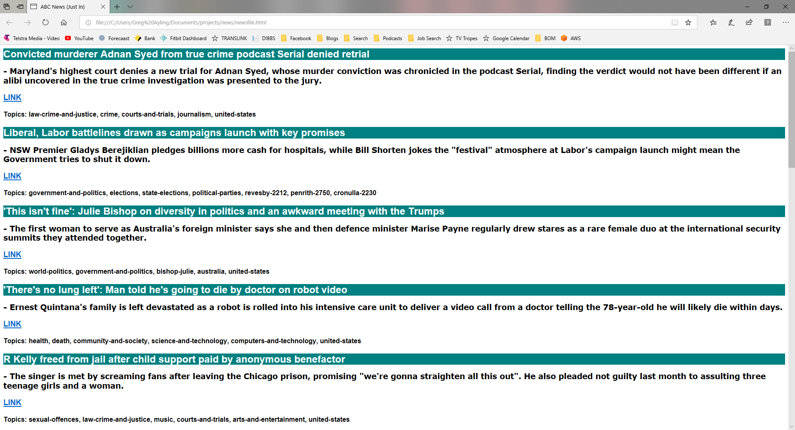

# News
This application scrapes the ABC News "Just In" page and redisplays the text in a HTML page.

All news items are listed, except those which contain the following topics (which aren't of interest to me):
* sport
* australia-day
* human-interest
* murder-and-manslaaughter

For each news item listed, the following information is displayed:
* Title
* Description
* Link to news item page
* List of topics

To run:
* pip install -r requirements.txt
* python news.py

Sample screen

